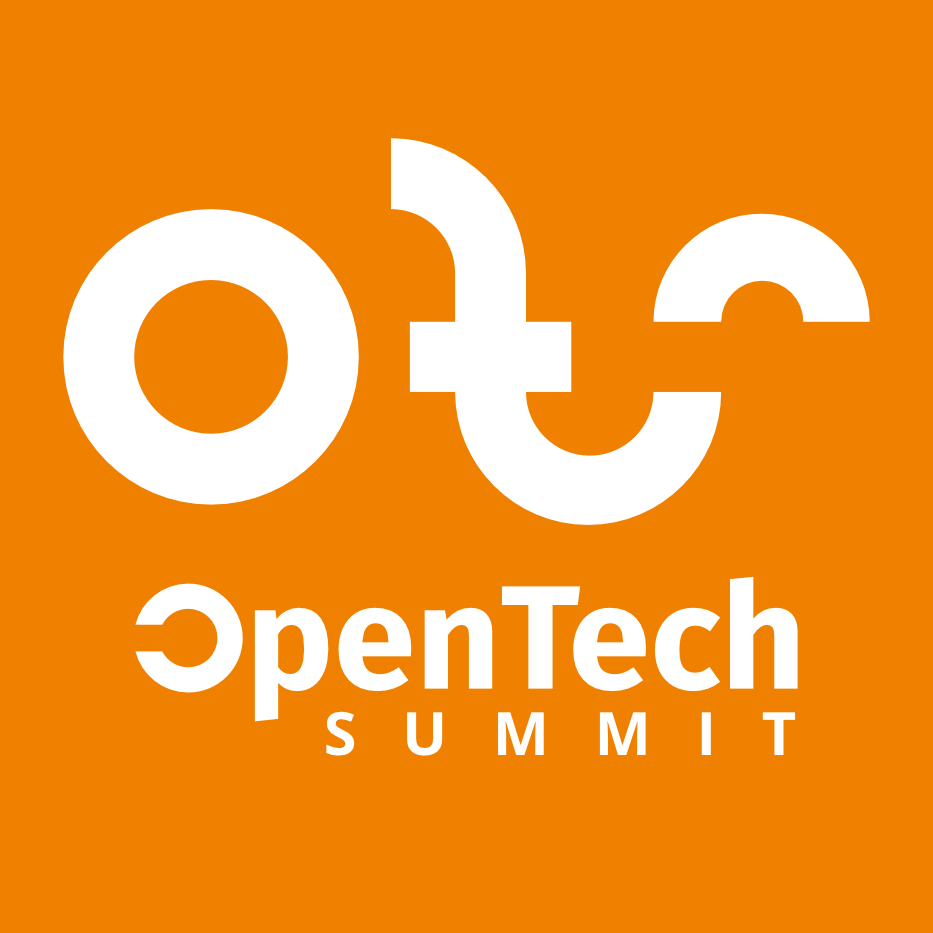

# iAmTeacher

iAmTeacher (pronounced I am teacher) is an AI-powered English tutor app for students in rural areas, which most of them lack capable English teachers. This app will focus on vocal conversations, while also including written quizzes and other educational activities.

## How it works (conversation)

The vocal conversation parts will be working with OpenAI's Realtime API services. We'll give it a system prompt, and these will happen during the conversation:

1. Student starts the conversation
2. The frontend app will connect to the OpenAI's Realtime API via WebRTC, using an ephemeral key generated by the backend.
3. What the student said will be transcribed into the LLM's input.
4. The output of the LLM will go into Text-to-Speech and played on the student's device.
5. Repeat 3-4 until conversation goals accomplished and finished

## Features we should have

- Multiple tuition/teaching styles to choose from
- The possibility of tailoring contents according to student's skill level and learning goals
- The possibility of using alternative voice recognition, LLM and TTS platforms.

## Usage

_Before you begin, you'll need an OpenAI API key - [create one in the dashboard here](https://platform.openai.com/settings/api-keys)._

Clone this repo

```
git clone https://github.com/zymple/iamteacher.git
cd iamteacher
```

Create a `.env` file from the example file and set your API key in there (or check .env.example):

```bash
OPENAI_API_KEY=<your_openai_api_key>
DEBUG=<True OR False>
VITE_ALLOWED_HOSTS=localhost,127.0.0.1
LOGGING=<True OR False>
// Example
```

Running this application locally requires [Node.js](https://nodejs.org/) to be installed. Install dependencies for the application with:

```bash
npm install
```

Start the application server with:

```bash
npm start
```

The default email is ``demo@demo.com`` and the password is ``demopassword``

This should start the application on [http://localhost:3000](http://localhost:3000).


## License

- iAmTeacher Frontend/app is dual-licensed under the AGPLv3 license and a bespoke license granted exclusively to Zymple. While the general public may use, modify, and distribute the software under the terms of the AGPLv3, Zymple is additionally permitted to use, modify, and distribute the software under the terms of a separate, bespoke license at Zymple's discretion.

Zymple is a business unit of Manima BKK Co., Ltd.

## Special Thanks

This project is made possible by




